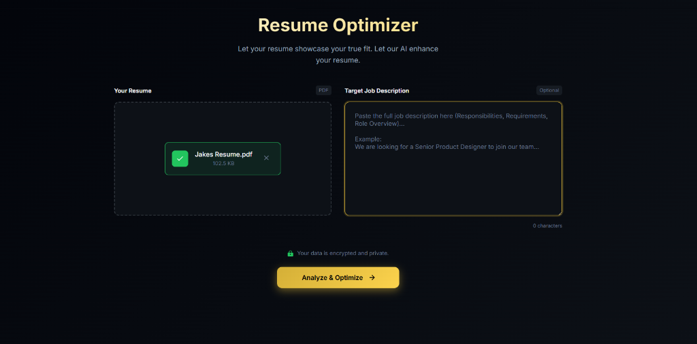
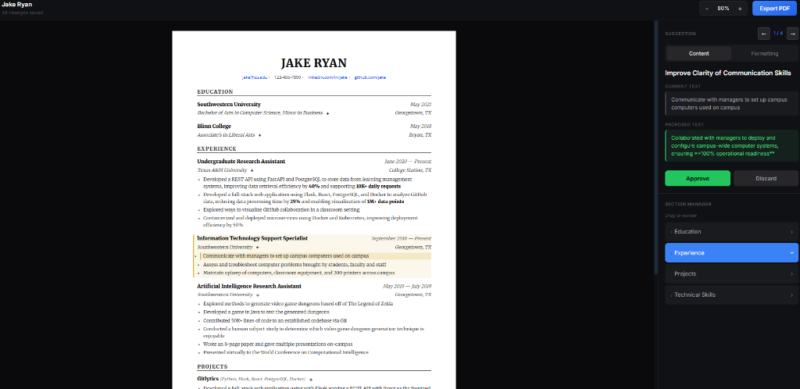

# ResumeOptimizer 🚀

**ResumeOptimizer** is a tool designed to help students and professionals increase their chances of getting hired. By optimizing resumes and improving keyword matching, this project aims to help candidates successfully pass through **Applicant Tracking Systems (ATS)**.

## Key Features

- **Resume Optimization**: Tailor your resume to highlight your strengths
- **ATS Keyword Matching**: Identify and include crucial keywords from job descriptions
- **AI-Powered Suggestions**: 
  - **Rewording**: Professionalize casual language with one click
  - **Formatting**: Fix inconsistent dates, caps, and spacing
- **Smart Bullet Management**: Easily add, remove, or reorder bullet points
- **Professional PDF Export**: Clean, ATS-friendly PDF output (No LaTeX required)
- **Live Preview**: See changes in real-time as you accept suggestions

## Screenshots

<div align="center">
  
  <p><em>Streamlined Upload & Job Description Analysis</em></p>
  <br/>
  
  <p><em>Real-time Editor with AI Suggestions</em></p>
</div>

## Getting Started

### Prerequisites

- Node.js 18+ (Next.js 16)
- OpenAI API key (Standard or Azure OpenAI)

### Setup

1. Clone the repository
2. Copy `.env.example` to `.env` and configure your API keys:
   ```bash
   cp .env.example .env
   ```
   **Note on API Keys:**
   You must provide EITHER an `OPENAI_API_KEY` (Standard) OR the following Azure credentials:
   - `AZURE_OPENAI_API_KEY`
   - `AZURE_OPENAI_ENDPOINT`
   - `AZURE_OPENAI_API_VERSION`
   - `AZURE_OPENAI_DEPLOYMENT_NAME`
   
   ⚠️ **Important:** Your `.env` file is automatically ignored by git to protect your keys. Never remove it from `.gitignore`.
3. Install dependencies:
   ```bash
   # Frontend
   cd frontend && npm install
   
   # Backend
   cd backend && pip install -r requirements.txt
   ```
4. Start the development servers:
   ```bash
   # Terminal 1 - Backend
   cd backend && uvicorn app.main:app --reload
   
   # Terminal 2 - Frontend
   cd frontend && npm run dev
   ```

## Documentation

- [Implementation Plan](./docs/IMPLEMENTATION_PLAN.md) - System design and architecture

## Security

⚠️ **Never commit your `.env` file!** The `.gitignore` is configured to exclude it automatically.

---
*Helping you land your dream job, one keyword at a time.*
