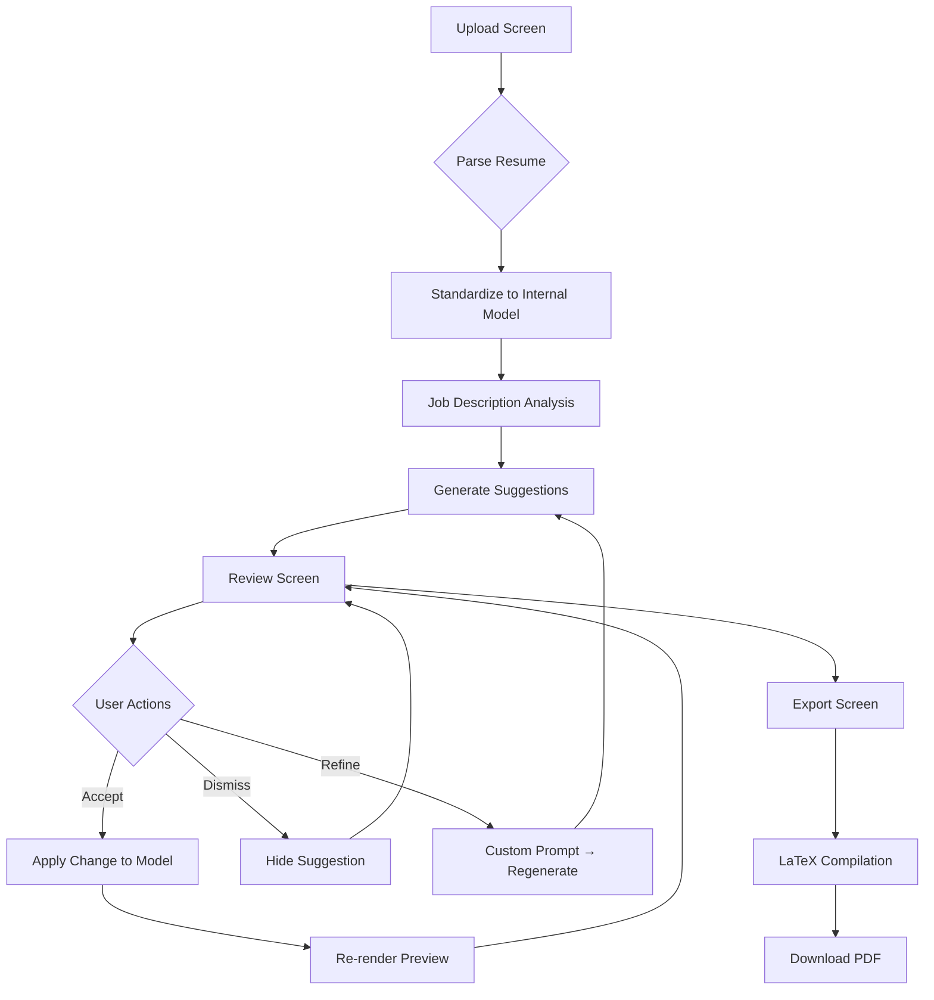
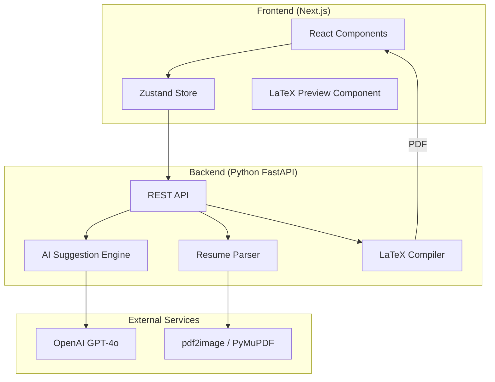

# Resume Optimizer — System Design & Implementation Plan

> A focused, elegant system that helps people turn messy, overstuffed resumes into clear, role-aligned documents they feel confident submitting.

---

## 1. Product Vision

**Core Experience:** The user always sees their resume as it will appear in the final PDF. The LaTeX-rendered preview IS the primary interface—not a separate view. When suggestions are accepted, the preview updates in real-time, so users immediately see the impact of their changes.

**Design Direction:**
- Dark, premium, calm aesthetic
- Split-pane: Live PDF preview (left) + Suggestions sidebar (right)
- Inline diffs shown on the preview itself when reviewing a suggestion
- Smooth transitions when changes are applied
- Minimal chrome, maximum focus on the resume

---

## 2. End-to-End User Flow



### Detailed Flow:

| Step | User Action | System Response |
|------|-------------|-----------------|
| 1 | Upload PDF/DOCX + Paste JD | Parse resume → Extract structured data |
| 2 | Click "Analyze & Optimize" | Generate AI suggestions against JD |
| 3 | Review suggestions in sidebar | Live preview with inline diffs |
| 4 | Accept/Dismiss each suggestion | Model updates, preview re-renders |
| 5 | Add sections via Quick Add | Modal for new content generation |
| 6 | Refine with custom prompts | Targeted AI regeneration |
| 7 | Click "Export PDF" | Compile LaTeX → Download |

---

## 3. Core Data Model

The key insight: **Treat the resume as a structured document, not as a LaTeX file**. LaTeX is purely the rendering layer.

### Resume Schema (TypeScript)

```typescript
interface Resume {
  id: string;
  metadata: ResumeMetadata;
  sections: ResumeSection[];
  version: number; // For undo/redo
  createdAt: Date;
  updatedAt: Date;
}

interface ResumeMetadata {
  name: string;
  location?: string;
  email?: string;
  phone?: string;
  linkedin?: string;
  website?: string;
  github?: string;
}

interface ResumeSection {
  id: string;
  type: SectionType;
  title: string;
  order: number;
  items: SectionItem[];
}

type SectionType = 
  | 'summary' 
  | 'experience' 
  | 'education' 
  | 'skills' 
  | 'projects' 
  | 'certifications' 
  | 'languages' 
  | 'custom';

interface SectionItem {
  id: string;
  order: number;
  content: ItemContent;
}

// Discriminated union for different item types
type ItemContent = 
  | ExperienceItem 
  | EducationItem 
  | SkillsItem 
  | SummaryItem 
  | ProjectItem
  | CustomItem;

interface ExperienceItem {
  type: 'experience';
  company: string;
  role: string;
  location?: string;
  startDate: string;
  endDate?: string; // "Present" as null
  bullets: Bullet[];
}

interface Bullet {
  id: string;
  text: string;
  order: number;
}

interface EducationItem {
  type: 'education';
  institution: string;
  degree: string;
  field?: string;
  location?: string;
  startDate?: string;
  endDate: string;
  gpa?: string;
  bullets: Bullet[];
}

interface SkillsItem {
  type: 'skills';
  categories: SkillCategory[];
}

interface SkillCategory {
  name: string; // "Technical", "Languages", "Methodologies"
  skills: string[];
}

interface SummaryItem {
  type: 'summary';
  text: string;
}

interface ProjectItem {
  type: 'project';
  name: string;
  description?: string;
  technologies?: string[];
  url?: string;
  bullets: Bullet[];
}

interface CustomItem {
  type: 'custom';
  title?: string;
  subtitle?: string;
  dateRange?: string;
  location?: string;
  bullets: Bullet[];
}
```

### Suggestion Model

```typescript
interface Suggestion {
  id: string;
  category: 'critical' | 'stylistic' | 'formatting' | 'missing_keyword';
  type: SuggestionType;
  targetPath: string; // JSONPath to target element, e.g., "sections[0].items[1].bullets[2]"
  title: string;
  description: string;
  originalValue?: string;
  suggestedValue?: string;
  status: 'pending' | 'accepted' | 'dismissed';
  priority: number; // For ordering
}

type SuggestionType = 
  | 'rewrite_bullet' 
  | 'add_keyword' 
  | 'remove_content' 
  | 'reorder_section' 
  | 'add_section' 
  | 'strengthen_verb'
  | 'fix_formatting'
  | 'quantify_impact';
```

### Job Description Model

```typescript
interface JobDescription {
  id: string;
  rawText: string;
  title?: string;
  company?: string;
  extractedKeywords: Keyword[];
  requiredSkills: string[];
  preferredSkills: string[];
  responsibilities: string[];
}

interface Keyword {
  term: string;
  frequency: number;
  category: 'skill' | 'methodology' | 'tool' | 'soft_skill';
  foundInResume: boolean;
}
```

---

## 4. Architecture Overview



---

## 5. Tech Stack Selection

### Frontend

| Technology | Purpose | Rationale |
|------------|---------|-----------|
| **Next.js 14** | Framework | App Router, Server Components, API routes |
| **TypeScript** | Type safety | Complex data models require strong typing |
| **Zustand** | State management | Simpler than Redux, perfect for document state |
| **CSS Modules** | Styling | Clean scoping, matches dark premium aesthetic |
| **react-pdf** | PDF preview | In-browser PDF rendering |
| **Framer Motion** | Animations | Micro-interactions for accept/dismiss |

### Backend

| Technology | Purpose | Rationale |
|------------|---------|-----------|
| **Python + FastAPI** | API server | Best ecosystem for document parsing & AI |
| **PyMuPDF (fitz)** | PDF parsing | Industry standard, handles complex layouts |
| **python-docx** | DOCX parsing | Native DOCX support |
| **LangChain** | AI orchestration | Structured outputs, prompt management |
| **OpenAI API** | LLM | Best-in-class for text generation; GPT-4o for suggestions |
| **subprocess + pdflatex** | LaTeX → PDF | Standard LaTeX compilation |

### Why This Split?

> [!IMPORTANT]
> The Python backend is essential for reliable document parsing. JavaScript-based PDF/DOCX parsing libraries are significantly less mature and would introduce fragility.

### Preview Architecture

The preview is a **live-rendered PDF** from LaTeX, not a mock or HTML approximation. This ensures:
- WYSIWYG accuracy—what you see is exactly what you'll download
- No surprises at export time
- Changes feel immediate and real

When a suggestion is hovered/selected, we overlay the diff on the current preview position. When accepted, we re-compile and swap the PDF seamlessly.

---

## 6. Key Abstractions

### 1. Document Store (Frontend)

Manages the resume state with undo/redo support:

```typescript
interface DocumentStore {
  resume: Resume | null;
  suggestions: Suggestion[];
  jobDescription: JobDescription | null;
  history: Resume[]; // For undo
  future: Resume[]; // For redo
  
  // Actions
  loadResume: (resume: Resume) => void;
  applySuggestion: (suggestionId: string) => void;
  dismissSuggestion: (suggestionId: string) => void;
  updateBullet: (path: string, newText: string) => void;
  reorderSection: (sectionId: string, newOrder: number) => void;
  addSection: (section: ResumeSection) => void;
  undo: () => void;
  redo: () => void;
}
```

### 2. Suggestion Engine (Backend)

Generates suggestions by comparing resume against JD:

```python
class SuggestionEngine:
    def analyze(
        self, 
        resume: ResumeModel, 
        job_description: JobDescriptionModel
    ) -> list[Suggestion]:
        suggestions = []
        suggestions.extend(self._check_missing_keywords(resume, job_description))
        suggestions.extend(self._check_weak_verbs(resume))
        suggestions.extend(self._suggest_quantifications(resume))
        suggestions.extend(self._check_relevance(resume, job_description))
        suggestions.extend(self._check_formatting(resume))
        return self._prioritize(suggestions)
```

### 3. LaTeX Renderer

Converts the internal Resume model to LaTeX:

```python
class LaTeXRenderer:
    def __init__(self, template_path: str):
        self.template = self._load_template(template_path)
    
    def render(self, resume: ResumeModel) -> str:
        """Converts Resume to LaTeX source"""
        ...
    
    def compile_to_pdf(self, latex_source: str) -> bytes:
        """Compiles LaTeX to PDF bytes"""
        ...
```

---

## 7. API Design

### Endpoints

| Method | Endpoint | Request | Response |
|--------|----------|---------|----------|
| `POST` | `/api/parse` | `{file: File}` | `{resume: Resume}` |
| `POST` | `/api/analyze` | `{resume, jobDescription}` | `{suggestions: Suggestion[], atsScore: number}` |
| `POST` | `/api/refine` | `{resume, targetPath, prompt}` | `{suggestions: Suggestion[]}` |
| `POST` | `/api/rewrite-bullet` | `{bullet, context, jobDescription}` | `{newBullet: string}` |
| `POST` | `/api/generate-section` | `{type, context, jobDescription}` | `{section: ResumeSection}` |
| `POST` | `/api/render` | `{resume}` | `{latex: string, pdfBase64: string}` |

---

## 8. Risk Analysis & Mitigations

| Risk | Impact | Likelihood | Mitigation |
|------|--------|------------|------------|
| **Resume parsing fails** | High | Medium | Graceful fallback to manual entry; structured error messaging |
| **LaTeX compilation fails** | High | Low | Sanitize inputs; template validation; show raw LaTeX for debugging |
| **AI suggestions are low quality** | Medium | Medium | Human-in-loop always; easy dismiss; refine with prompts |
| **One-page constraint broken** | High | Medium | Real-time page count indicator; AI suggestions to condense |
| **ATS score feels arbitrary** | Medium | High | Transparent scoring criteria; link to specific issues |
| **Slow performance** | Medium | Medium | Streaming responses; optimistic UI updates; caching |

### Fallback Strategies

1. **Parsing Fallback:** If automated parsing fails, show manual entry form pre-filled with best-effort extraction
2. **AI Fallback:** If LLM is unavailable, show "Suggestions unavailable" but allow manual editing
3. **LaTeX Fallback:** If compilation fails, offer raw LaTeX download for user to compile locally

---

## 9. Implementation Phases

### Phase 1: Foundation (Week 1)
> Get the core loop working: upload → parse → edit → export

- [ ] Project scaffolding (Next.js + FastAPI)
- [ ] Resume data model implementation
- [ ] PDF/DOCX parsing endpoints
- [ ] Manual resume editor (no AI)
- [ ] Basic LaTeX template
- [ ] PDF export pipeline

**Deliverable:** User can upload a resume, see it standardized, edit manually, and export PDF.

---

### Phase 2: AI Suggestions (Week 2)
> Add intelligence: analyze → suggest → accept/reject

- [ ] Job description parser
- [ ] Keyword extraction
- [ ] AI suggestion generation
- [ ] Suggestion sidebar UI
- [ ] Accept/dismiss flow
- [ ] Inline diff visualization
- [ ] ATS score calculation

**Deliverable:** AI suggests improvements; user reviews and accepts changes.

---

### Phase 3: Polish & Refinement (Week 3)
> Make it feel premium: animations, edge cases, error handling

- [ ] Undo/redo support
- [ ] Refine with prompt feature
- [ ] Quick-add sections
- [ ] Page count indicator
- [ ] Loading states & animations
- [ ] Error boundaries
- [ ] Mobile responsiveness

**Deliverable:** Production-quality experience with all core features.

---

### Phase 4: Quality & Edge Cases (Week 4)
> Harden for real-world resumes

- [ ] Handle diverse resume formats
- [ ] Multi-column PDF parsing
- [ ] International date formats
- [ ] Special characters in LaTeX
- [ ] Integration tests
- [ ] Performance optimization

**Deliverable:** Robust system handling edge cases gracefully.

---

## 10. File Structure

```
ResumeOptimizer/
├── frontend/                    # Next.js application
│   ├── app/
│   │   ├── page.tsx            # Upload screen
│   │   ├── editor/
│   │   │   └── page.tsx        # Review & edit screen
│   │   └── export/
│   │       └── page.tsx        # Final export screen
│   ├── components/
│   │   ├── ResumePreview/
│   │   ├── SuggestionsSidebar/
│   │   ├── FileUpload/
│   │   └── DiffViewer/
│   ├── lib/
│   │   ├── store.ts            # Zustand store
│   │   ├── types.ts            # TypeScript types
│   │   └── api.ts              # API client
│   └── styles/
│       └── globals.css
│
├── backend/                     # Python FastAPI
│   ├── app/
│   │   ├── main.py             # FastAPI app
│   │   ├── routers/
│   │   │   ├── parse.py
│   │   │   ├── analyze.py
│   │   │   └── render.py
│   │   ├── services/
│   │   │   ├── parser.py
│   │   │   ├── suggestion_engine.py
│   │   │   └── latex_renderer.py
│   │   ├── models/
│   │   │   ├── resume.py
│   │   │   ├── suggestion.py
│   │   │   └── job_description.py
│   │   └── templates/
│   │       └── resume.tex
│   ├── requirements.txt
│   └── Dockerfile
│
├── docs/                        # Documentation
│   └── IMPLEMENTATION_PLAN.md
│
└── README.md
```

---

## 11. Key Design Decisions

### Decision 1: Separate Frontend and Backend

**Why:** Document parsing requires Python's mature ecosystem. Trying to do this in JavaScript would be fragile and underperform.

**Tradeoff:** More complex deployment (two services).

**Mitigation:** Docker Compose for local dev; single deployment target for production.

---

### Decision 2: Structured Resume Model (Not Raw Text)

**Why:** Enables precise edits, reordering, and undo/redo. Raw text would make "move this section up" or "edit this bullet" extremely fragile.

**Tradeoff:** More complex parsing; lossy conversion from original.

**Mitigation:** This is intentional—we don't preserve original formatting.

---

### Decision 3: LaTeX as Render-Only Layer

**Why:** LaTeX is powerful for output but terrible for editing. Users shouldn't see or think about LaTeX.

**Tradeoff:** Can't leverage existing LaTeX resumes directly.

**Mitigation:** Parse content from any format; regenerate LaTeX on export.

---

### Decision 4: Suggestions as Discrete Actions (Not Auto-Apply)

**Why:** User control is a core principle. Every change should be reviewed.

**Tradeoff:** More clicks for user.

**Mitigation:** Batch accept for low-risk suggestions; keyboard shortcuts.

---

## 12. Verification Plan

### Automated Tests
- Unit tests: Resume model serialization, suggestion priority logic
- Integration: Parse → Edit → Export pipeline
- E2E: Upload flow with test PDFs

### Manual Testing
- Test with 10+ real-world resumes (various formats)
- Validate ATS compatibility with Jobscan
- Test LaTeX output with TinyTeX, TeX Live

---

## 13. Next Steps

Phase 1: Foundation is ready to begin:

1. **Project scaffolding** — Next.js 14 + FastAPI in monorepo structure
2. **Resume data model** — TypeScript types + Pydantic models
3. **PDF/DOCX parsing** — PyMuPDF integration with fallback handling
4. **LaTeX template** — Clean, ATS-friendly single-page template
5. **Live preview pipeline** — Upload → Parse → Render → Display
6. **Basic editing** — Manual bullet editing with instant re-render

The focus is getting the core loop working end-to-end before adding AI suggestions.
