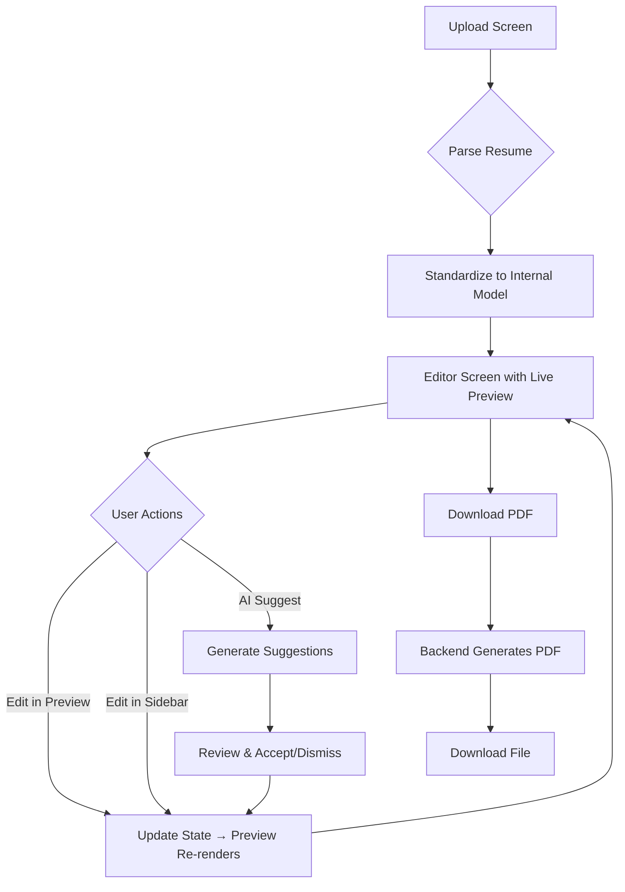

# Resume Optimizer — System Design & Implementation Plan

> A focused, elegant system that helps people turn messy, overstuffed resumes into clear, role-aligned documents they feel confident submitting.

---

## 1. Product Vision

**Core Experience:** The user always sees their resume as it will appear in the final PDF. The live preview IS the primary interface—not a separate view. When edits are made or suggestions are accepted, the preview updates in real-time, so users immediately see the impact of their changes.

**Design Direction:**
- Dark, premium, calm aesthetic
- Split-pane: Live HTML preview (left) + Quick Edit sidebar (right)
- Inline editing directly in the preview
- Smooth transitions when changes are applied
- Minimal chrome, maximum focus on the resume

---

## 2. Rendering Architecture (UPDATED)

### Key Insight: Frontend Renders, Backend Generates PDF

The preview is rendered **directly in the frontend** using React components. This eliminates API round-trips for preview updates and avoids serialization issues with Pydantic Union types.

```
┌─────────────────────────────────────────────────────────────────┐
│  FRONTEND (Next.js)                                              │
│                                                                   │
│  ┌─────────────┐     ┌──────────────────────┐                   │
│  │ Resume State │────▶│ ResumePreview.tsx    │ ◀── Instant!     │
│  │ (Zustand)    │     │ (React Component)    │     No API call   │
│  └─────────────┘     └──────────────────────┘                   │
│         │                                                         │
│         │ "Download PDF" clicked                                 │
│         ▼                                                         │
│  ┌─────────────────┐                                             │
│  │ API Call        │─────────────────────────────┐               │
│  │ /api/render/pdf │                             │               │
│  └─────────────────┘                             │               │
└──────────────────────────────────────────────────│───────────────┘
                                                   │
┌──────────────────────────────────────────────────│───────────────┐
│  BACKEND (FastAPI)                               │               │
│                                                   ▼               │
│                                          ┌──────────────────┐    │
│                                          │ PDFRenderer      │    │
│                                          │ (ReportLab)      │    │
│                                          └────────┬─────────┘    │
│                                                   │              │
│                                                   ▼              │
│                                          ┌──────────────────┐    │
│                                          │ PDF Bytes        │    │
│                                          │ (Download)       │    │
│                                          └──────────────────┘    │
│                                                                   │
└───────────────────────────────────────────────────────────────────┘
```

### Benefits of This Approach:
1. **Instant preview updates** - No API round-trip, no network latency
2. **No serialization issues** - Data stays as TypeScript objects
3. **Single source of truth** - Frontend state drives everything
4. **Simpler backend** - Only generates PDF on demand

---

## 3. End-to-End User Flow



---

## 4. Core Data Model

The key insight: **Treat the resume as a structured document, not as a PDF**. PDF is purely the export format.

### Resume Schema (TypeScript)

```typescript
interface Resume {
  id: string;
  metadata: ResumeMetadata;
  sections: ResumeSection[];
  version: number;
  createdAt: Date;
  updatedAt: Date;
}

interface ResumeMetadata {
  name: string;
  location?: string;
  email?: string;
  phone?: string;
  linkedin?: string;
  website?: string;
  github?: string;
}

interface ResumeSection {
  id: string;
  type: SectionType;
  title: string;
  order: number;
  items: SectionItem[];
}

type SectionType = 
  | 'summary' 
  | 'experience' 
  | 'education' 
  | 'skills' 
  | 'projects' 
  | 'certifications' 
  | 'custom';

interface SectionItem {
  id: string;
  order: number;
  content: ItemContent;
}

// Discriminated union for different item types
type ItemContent = 
  | ExperienceItem 
  | EducationItem 
  | SkillsItem 
  | SummaryItem 
  | ProjectItem
  | CustomItem;

interface ExperienceItem {
  type: 'experience';
  company: string;
  role: string;
  location?: string;
  startDate: string;
  endDate?: string;
  bullets: Bullet[];
}

interface Bullet {
  id: string;
  text: string;
  order: number;
}

interface EducationItem {
  type: 'education';
  institution: string;
  degree: string;
  field?: string;
  location?: string;
  startDate?: string;
  endDate: string;
  gpa?: string;
}

interface SkillsItem {
  type: 'skills';
  categories: SkillCategory[];
}

interface SkillCategory {
  name: string;
  skills: string[];
}

interface SummaryItem {
  type: 'summary';
  text: string;
}

interface ProjectItem {
  type: 'project';
  name: string;
  description?: string;
  technologies?: string[];
  bullets: Bullet[];
}

interface CustomItem {
  type: 'custom';
  title?: string;
  bullets: Bullet[];
}
```

---

## 5. Tech Stack

### Frontend

| Technology | Purpose | Rationale |
|------------|---------|-----------|
| **Next.js 14** | Framework | App Router, TypeScript support |
| **TypeScript** | Type safety | Complex data models |
| **Zustand** | State management | Simple, powerful, undo/redo |
| **CSS Modules** | Styling | Scoped styles, premium aesthetic |
| **ResumePreview** | Live preview | React component, instant updates |

### Backend

| Technology | Purpose | Rationale |
|------------|---------|-----------|
| **Python + FastAPI** | API server | Best for document parsing & AI |
| **PyMuPDF (fitz)** | PDF Text Extraction | Extract raw text for AI processing |
| **OpenAI GPT-4o** | Resume Parsing | 100% accurate structural extraction |
| **ReportLab** | PDF generation | Pure Python, no external deps |
| **OpenAI API** | AI suggestions | GPT-4o for text improvement |

---

## 6. API Design

| Method | Endpoint | Request | Response |
|--------|----------|---------|----------|
| `POST` | `/api/parse` | `{file: File}` | `{resume: Resume, warnings: string[]}` |
| `POST` | `/api/render/pdf` | `{resume: Resume}` | `PDF file (binary)` |
| `POST` | `/api/analyze` | `{resume, jobDescription}` | `{suggestions: Suggestion[]}` |
| `POST` | `/api/rewrite` | `{text, context, jd}` | `{newText: string}` |

### Key Change: No HTML rendering endpoint!

The frontend renders HTML directly. The backend only generates PDF when user downloads.

---

## 7. Component Structure

### ResumePreview Component
The heart of the editor—a React component thatrenders the Resume model as a styled "Paper" document:

```tsx
// components/ResumePreview/ResumePreview.tsx
interface ResumePreviewProps {
  resume: Resume;
  onBulletEdit?: (sectionId: string, itemId: string, bulletId: string, text: string) => void;
  onMetadataEdit?: (field: string, value: string) => void;
}

function ResumePreview({ resume, onBulletEdit, onMetadataEdit }: ResumePreviewProps) {
  return (
    <div className={styles.resume}>
      {/* Renders styled A4 paper with Merriweather font */}
      <Header metadata={resume.metadata} onEdit={onMetadataEdit} />
      <div className={styles.sections}>
         {/* Sorts and renders sections */}
      </div>
    </div>
  );
}
```

### Editor Page
The editor implements the "AI Copilot" layout:
- **Left**: Dark canvas with zoomable `ResumePreview` (Paper view).
- **Right**: Sidebar with AI suggestions, Score, and Chat.
- **Top**: Header with Export PDF.

---

## 8. File Structure (Current)

```
ResumeOptimizer/
├── frontend/
│   ├── src/
│   │   ├── app/
│   │   │   ├── page.tsx              # Upload screen
│   │   │   ├── editor/
│   │   │   │   ├── page.tsx          # Editor with AI Sidebar & Preview
│   │   │   │   └── page.module.css   # Dark theme styles
│   │   │   └── globals.css
│   │   ├── components/
│   │   │   ├── ResumePreview/        # ★ Core Preview Engine
│   │   │   │   ├── ResumePreview.tsx
│   │   │   │   └── ResumePreview.module.css
│   │   └── lib/
│   │       ├── store.ts              # Zustand store
│   │       ├── types.ts              # TypeScript types
│   │       └── api.ts                # API client
│   └── package.json
│
├── backend/
│   ├── app/
│   │   ├── main.py
│   │   ├── routers/
│   │   │   ├── parse.py              # AI Resume parsing (GPT-4o)
│   │   │   ├── render.py             # PDF generation (ReportLab)
│   │   │   └── analyze.py            # (Phase 2) AI Analysis
│   │   ├── services/
│   │   │   ├── parser.py             # LLM Extraction Logic
│   │   │   └── pdf_renderer.py       # ReportLab PDF Logic
│   │   └── models/
│   │       └── resume.py
│   └── requirements.txt
│
└── docs/
    └── IMPLEMENTATION_PLAN.md
```

---

## 9. Implementation Phases

### Phase 1: Foundation ✅ (Completed)
- [x] Project scaffolding (Next.js + FastAPI)
- [x] Resume data model (Pydantic + TypeScript)
- [x] **AI-Powered Parsing** (GPT-4o for 100% extracted structure)
- [x] **Premium Editor UI** (Dark mode, A4 Paper Preview, Sidebar scaffolding)
- [x] **Frontend Rendering** (React components, no HTML middleware)
- [x] PDF Export (ReportLab matches React design)

### Phase 2: AI Intelligence ✅ (Completed)
- [x] Implement `analyze.py` to generate real suggestions
- [x] Connect "Accept" buttons in Sidebar to `updateBullet` state
- [x] Job Description Analysis & Keyword Matching
- [x] Match Score display (separate from ATS score)
- [x] Keywords panel showing matched/missing keywords
- [x] Content vs Formatting suggestion tabs

### Phase 3: Bug Fixes & Polish ✅ (Completed)
- [x] Keywords tab error (`matchScore` undefined) - Fixed
- [x] Arrow navigation for suggestion cycling (← →)
- [x] Skills section ADD suggestions working
- [x] Custom AI edit backend (`custom_edit` in analysis.py)

### Remaining Items (Low Priority)
- [ ] Section reorder drag-and-drop (code exists, needs testing)
- [ ] Undo/Redo functionality (history/future arrays exist, needs testing)
- [ ] Edge case handling (empty sections, validation)

---


## 10. Status Summary
**All Core Features Complete.** (Last updated: 2026-02-01)

### What's Working:
- ✅ AI-powered resume parsing (GPT-4o)
- ✅ Live preview editor with inline editing
- ✅ AI suggestions with Accept/Dismiss
- ✅ Job description keyword matching
- ✅ Match score & keyword visualization
- ✅ Content/Formatting dual suggestion tabs
- ✅ Arrow navigation for suggestions
- ✅ Skills section ADD functionality
- ✅ PDF export (ReportLab)

### Key Decisions Made:
1. **Frontend Rendering** - Preview renders in React (no backend HTML)
2. **Azure OpenAI** - Using Azure OpenAI for analysis
3. **Suggestion Categories** - Split into content vs formatting

### Next Steps (Optional Polish):
- Manual testing of section reorder
- Testing undo/redo functionality
- Edge case handling

